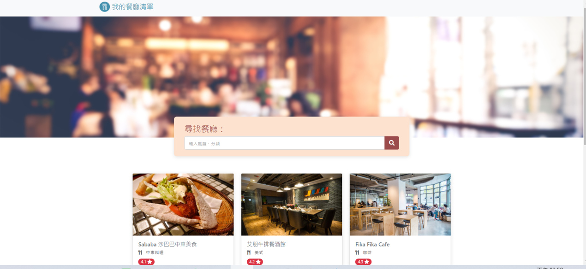

# 餐廳清單 2.0


使用 Node.js 與 Express 建立的餐廳清單，可用關鍵字查閱、新增、修改和刪除餐廳資料。

## 功能列表
- 可查看所有餐廳訊息
- 可針對關鍵字搜尋
- 可瀏覽餐廳詳細資訊
- 可更新/修改餐廳資訊
- 可新增餐廳名單
- 可刪除餐廳名單

## 安裝說明
1. 請先確認有安裝 node.js 與 npm
2. 將專案 clone 到本地
3. 在本地開啟之後，透過終端機進入資料夾，輸入：

   ```bash
   npm install
   ```

4. 安裝完畢後，繼續輸入：

   ```bash
   npm run start
   ```

5. 若看見此行訊息則代表順利運行，打開瀏覽器進入到以下網址

   ```bash
   Listening on http://localhost:3000
   ```

6. 若欲暫停使用

   ```bash
   ctrl + c
   ```
## 開發工具

- Node.js 16.13.0
- Express 4.17.1
- Express-Handlebars 5.3.5
- Bootstrap 4.3.1
- Font-awesome 5.8.1
- MongoDB
- mongoose 6.0.14
- method-override": 3.0.0


